<div align="center">



</div>

<div align="center">

[](https://git.io/typing-svg)

</div>

---


### `> sobre mim`

```
Meu nome é Thiago Costa, tenho 19 anos e sou um desenvolvedor em formação pelo SENAI Jandira. 
Sempre buscando aprender novas tecnologias para entregar soluções eficientes.
Atualmente, foco meus estudos no desenvolvimento de sistemas e automações, enquanto busco minha primeira
oportunidade no mercado de tecnologia para colocar meu conhecimento em prática e evoluir constantemente.


------------------------------"I determine my own destiny."------------------------------
```

<br/><br/><br/><br/><br/>

---

### `> tecnologias`

<br/>


<br/><br/><br/><br/>

---

### `> estatísticas`

<div align="center">


</div>

---

### `> contribuições`

<div align="center">

<picture>
  <source media="(prefers-color-scheme: dark)" srcset="https://raw.githubusercontent.com/alvesthzin-art/alvesthzin-art/output/github-contribution-grid-snake-dark.svg"/>
  <source media="(prefers-color-scheme: light)" srcset="https://raw.githubusercontent.com/alvesthzin-art/alvesthzin-art/output/github-contribution-grid-snake.svg"/>
  
</picture>

</div>

---

### `> contato`

<div align="center">

[](https://www.instagram.com/alves_th7?igsh=MWxsOXR1N214Mjlkbw==)
[](https://wa.me/5511977832812)
[](mailto:alvesthzin02@gmail.com)

</div>

---


<div align="center">

> *"People's lives don't end when they die. It ends when they lose faith."*
>
> — **Itachi Uchiha**

<br/>


&nbsp;


<br/>


</div>


